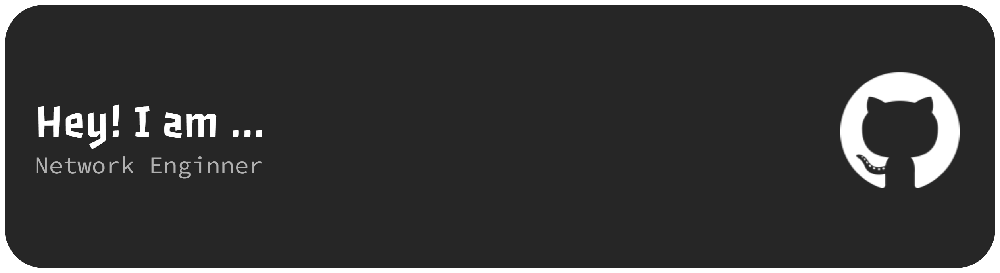

  

<h1 align="center">
  
</h1>

  

---

## 🌐 About Me

- 🎓 **Computer Network Student** at NSBM Green University.
- 🌟 Aspiring **Network Engineer** with a strong interest in **Network Security**, **Server Administration**, and **Infrastructure Design**.
- 💡 I focus on building secure network environments and efficient software solutions.
- 🚀 **Current Projects:**
  - 🏥 *Hospital Database Management System* – Integrated network-based data handling.
  - 🏫 *International School Web Platform* – Deployed with network configuration and access control.
- 🌱 **Currently Learning:** `Cisco (CCNA)`, `Linux Server Management`, `Virtualization`, and `Network Monitoring Tools`.
- 📬 Reach me: **nethminikavindi1@gmail.com**

---

## 🚀 Key Projects

<table width="100%">
  <tr>
    <td width="50%" valign="top">
      <h3>🏥 Hospital DBMS</h3>
      
Integrated network-based data handling for patients and medical staff using <b>SQL</b> and <b>Java</b>.

      <a href="https://github.com/Kavindi52"><b>View Repository</b></a>
    </td>
    <td width="50%" valign="top">
      <h3>🏫 International School Web</h3>
      
Web platform deployed on local servers with <b>Network Access Control</b> and <b>Secure Protocols</b>.

      <a href="https://github.com/Kavindi52"><b>View Repository</b></a>
    </td>
  </tr>
</table>

---

## 🧰 Tech Toolbox

### 🧠 Languages & Frameworks

  
  
  
  

### ☁️ Tools, Cloud & Networking

  
  
  
  
  

### 💾 Databases

  
  
  

---

## 📊 GitHub Stats

  
  
  
  

---

## 🐍 Contribution Snake

  

---

## 🔗 Connect with Me

  
  

---

## 🌸 My Motto
> _“Don’t be afraid to sparkle a little brighter.”_ ✨🌸

  

